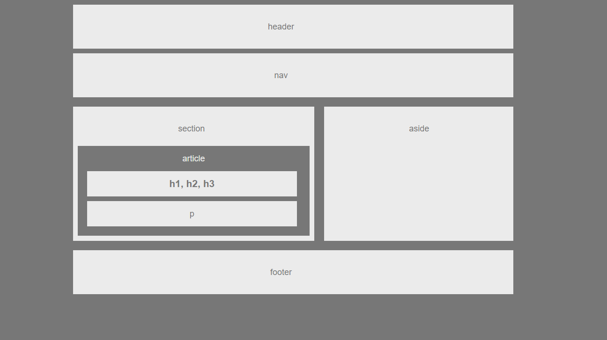

# HW-Wireframe

## Easier Assignment - Building a Wireframe

### Overview

In this assignment, you will build a web design skeleton using HTML/CSS. Your completed work should look just like the image below:

<!-- This also work, but can't resize the photo

-->

### Additional Specifications

1. Your HTML should have each of the following sections:
   * Header
   * Nav
   * Aside (With a Heading)
   * Section (With a Heading)
   * Article (With a Heading) contained within the Section
   * Headers contained within the Article
   * Paragraph contained within the Article
2. Your CSS should have styles for each of the following elements:
   * Body
     * font-family: 'Arial', 'Helvetica Neue', Helvetica, sans-serif;
     * color: '#777'
     * background: '#777'
     * width: '960px'
     * font-size: '18px'
   * Header, Nav, Section, Aside, and Footer
     * background: '#ebebeb'
   * Article
     * color: '#ebebeb',
     * background: '#777'
   * h1 and p
     * color: '#777',
     * background: '#ebebeb'
3. The width of the section should be:
   * section: 495px

### Helpful Hints

* For a refresher on working with Git and GitHub, consult the GitHub Supplemental Guide we sent you in class.
* Don't forget to review these concepts: `float`, `padding`, `margin`, `display`, `overflow`, `clear` and `text-align`.
* This will be a tough assignment. Towards the end of the course, you'll look back to this exercise and realize just how much you've grown as a developer. Stay positive!
